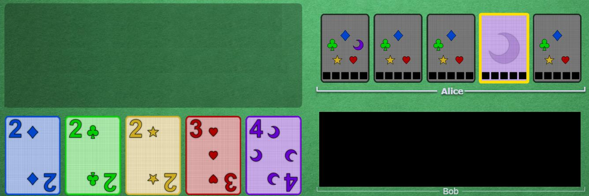

# Good Touch principle

 

## Principle

We define "touching a card" as "Giving a clue that involves a card"
 
When cluing cards, we should try, as much as possible, to touch only cards that will be played eventually, which we call "useful cards".
Using this principle, we can deduce much information about our own hand from the clues we have (and have not) received.

This should be taken into account when choosing if you tell someone the number or the color of the card you want them to play. If either way violates the good touch principle, you should choose the other one.
If both ways respect the good touch principle, and you know that both will lead to the result you want (the person won't misunderstand the clue), then you should choose the way that gives the most "extra" information (touching other, unrelated useful cards) in addition to the one you want.

 

## Examples

In this picture, Alice has received a clue (no matter how long ago) on a card, telling her that it is purple. Since there exists only one purple card that is useful at this point in the game, if Alice trusts that her teammates only touched useful cards, she can expect that purple card to be the 5, and play it. 
 

    

 
 

## Exceptions:

* You are allowed to touch, as an extra, known trash cards, if and only if the fact that they are trash will be immediatly obvious to the person, and they cannot mistake them for useful cards.
	* Example 1: cluing many 1s when there is only one remaining to be played. As soon as it is played, the person who played it knows the others are trash, and will not mistake them.
	* Exemple 2: Cluing green cards with the green 5, so when the 5 is played, all other become useless and the person knows it.
* You are allowed to touch trash that is not known to be trash, if the team somehow can't afford to wait for a better situation
	* Example: A player needs to play their card now, and you can't afford to wait for them to discard the trash. You may need to fix the situation later to avoid a misplay.

 

## Navigation

* [Level 1 - First Principles](https://github.com/agilbert1412/HanabiStrategy/blob/master/Strategy/Level%201%20-%20First%20Principles/Level%201%20-%20First%20Principles.md)

* [Previous: The Chop](https://github.com/agilbert1412/HanabiStrategy/blob/master/Strategy/Level%201%20-%20First%20Principles/1%20-%20The%20Chop.md)
	* When you discard an unknown card, always choose the oldest unclued card in your hand. Always pick up new cards on the same side to make this easy to track.
	
* [Next: The Focus](https://github.com/agilbert1412/HanabiStrategy/blob/master/Strategy/Level%201%20-%20First%20Principles/3%20-%20The%20Focus.md)
	* For a given clue, only one card is garanteed to be important right now. If the chop was touched, it is the focus. Otherwise, the focus is the newest card that was unclued before that clue.