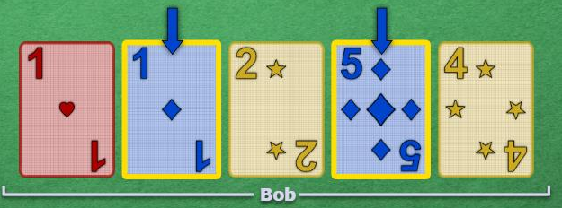
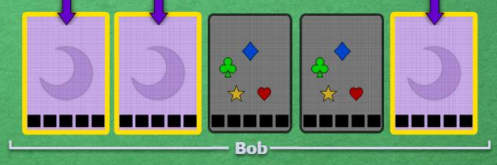

# The Focus

 

## Principle

We should only give out clues when there is a reason for that clue. This directly brings the concept that, for a clue, there is one card that is the focus.

Following from Good Touch Principle, all the cards touched must be useful later, but there is no point giving a clue for something that won't be useful until several turns.

The focused card is the reason why we decided to give this clue right now as opposed to waiting until later, so it should give out information that is important right now.

Since none of the players choose the order that the other players draw cards, and can't reorder them, we have to rely on probabilities to hope that the focus is the card we want it to be.

First of all, only newly touched cards are taken into account when figuring out the focus of a clue, you can disregard any card that already had a clue on it.

Those cards are considered collateral, and you received extra information for those cards which may or may not prove useful right now, not implying anything else.

If only already-touched cards are clued, then act like they are all newly touched for the sake of finding the focus

At all points of the game, you are more likely to have important cards on your newest spot, because they could have been clued earlier if you had drawn them earlier, so when a clue touches multiple cards, the focus is the newest one, simply because that's what you will need to focus more often.

The exception is the chop. If the chop is one of the clued cards, it takes priority and becomes the focus of the clue. This is because, if it comes down to a bad scenario where you can't clue the card you want with a correct focus, you can always wait until it reaches the chop and correctky to focus it then, before it is lost.

 

## Examples

Assuming that Bob draws new cards on the left in the screenshot, this "blue" clue here is a focus on the 1 (newer), and he now knows that the other card is a blue that will be important later, but can't guess if it is a 2, 3, 4 or 5. He will play it when he receives more information, or when only the 5 is left to be played.

    

Here, Bob should assume that his chop (right-most, assuming he draws on the left again) is the next purple card to be played, and play it, while keeping the other two for later. Even if only the 4 and 5 are left afterwards, he should not try to guess which is which, he will need more information.

    

 

## Navigation

* [Level 1 - First Principles](https://github.com/agilbert1412/HanabiStrategy/blob/master/Strategy/Level%201%20-%20First%20Principles/Level%201%20-%20First%20Principles.md)

* [Previous: Good Touch Principle](https://github.com/agilbert1412/HanabiStrategy/blob/master/Strategy/Level%201%20-%20First%20Principles/2%20-%20The%20Good%20Touch%20Principle.md)
	* All clues should, within reason, only touch cards that will be played at some point later, or if they are trash, it must be immediately obvious to the receiver.
	
* [Next: Save Principle](https://github.com/agilbert1412/HanabiStrategy/blob/master/Strategy/Level%201%20-%20First%20Principles/4%20-%20Save%20Principle.md)
	* The last copy of a card should not be discarded. Any clue that focuses the chop and could be a Save clue should be considered as such until more information is acquired.