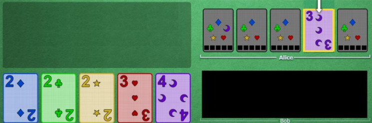
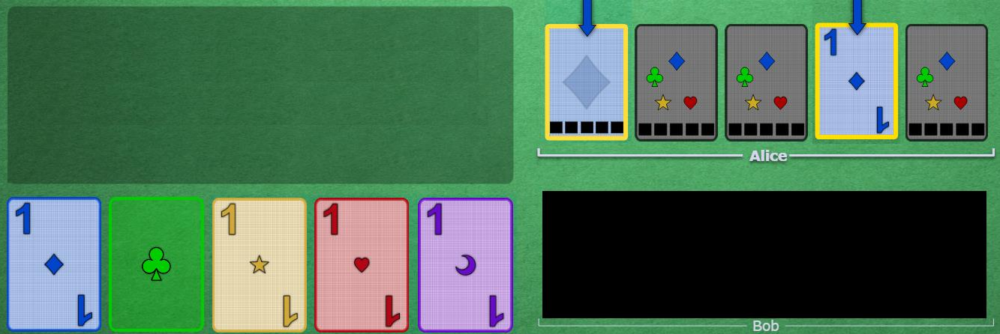

# Fix Clue

 

## Principle

Most of the plays that may look like a mistake should be interpreted as a good move first, and you must assume that your hand has whatever is needed for the play to not be a mistake ([Trust your team](https://github.com/agilbert1412/HanabiStrategy/blob/master/Strategy/Level%201%20-%20First%20Principles/6%20-%20Trust%20Your%20Team.md)).

Fix clues are clues that are used to fix an impending misplay that you are 100% sure will happen. It is a clue that touches at least one card that the owner thought he knew the exact identity, by giving him enough information to figure out that he was wrong about it.

There is no focus on a fix clue. The receiver was sure that he knew something, and that clue told him that he was wrong, it doesn't matter what else is touched by the clue.
If at least one card was literally "changed" in the mind of the receiver, it is a fix clue, and everything else is just extra info. 

Fix clues should still at least attempt to follow good touch principle, otherwise it will require another fix clue later.

A fix clue should only be given if at least one of those is true:
* The impending misplay will kill the game (the team is on their last life)
* The impending misplay will destroy a critical card
* The fix clue can be given in a manner to "good touch" at least one other useful card.

This is because a fix clue is spending a clue to save a life and a card. If the card is trash and the team is at 3 lives, it can be misplayed, because saving it just to make the person discard it is spending a clue to get a clue, which is not worth it. If good touch allows you to make the fix and touch a future important card, then it is also worth it, since it is value-equivalent to a 1-card play clue.

Fix clues should NEVER be given too early, so that the person was not "ready" to misplay yet (not enough information), because they will not interpret it as a fix clue, but as a play clue on either the misplay card, or the (imagined) focus of whatever else you touched.

In many cases, if you wait long enough, you won't even need to fix the impending misplay, because contextual information might fix it naturally.

 

## Examples

### Examples of situation where you don't need to fix it

* Alice has a red2 touched as "red", but the pile is already up to 3. Someone clues "4" on something else in her hand, so she believes the red card is the 5. Someone picks up the real red5 before the team plays red4. Alice knows her red is trash and discards it without receiving a fix clue
* Alice has a yellow1 touched as "1", but the yellow1 is already played. She has no other yellows in her hand. Everyone lets her misplay the card, because saving it is not worth the clue.

### Exemples of fix clue required situations:

1: Alice knew this was purple, and good touch garanteed it was the 5 (last purple non-trash card). The team already lost two lives. Now that the 5 is playable, Bob tells her that it is a 3 to avoid the misplay.
Until the 4 was played, there was a chance somebody would draw the real purple 5 and remove the need for a fix clue, so Bob waited until the last minute to give it.

    

2: Alice had a clued 1, and good touch told her it was green (last useful 1), so Bob gives her blue to avoid the misplay, AND touches another blue (good touch) for later. Alice must not assume that the other blue is playable right now

    

 

## Navigation

* [Level 1 - First Principles](https://github.com/agilbert1412/HanabiStrategy/blob/master/Strategy/Level%201%20-%20First%20Principles/Level%201%20-%20First%20Principles.md)
	
* [Previous: Trust Your Team](https://github.com/agilbert1412/HanabiStrategy/blob/master/Strategy/Level%201%20-%20First%20Principles/6%20-%20Trust%20Your%20Team.md)
	* Assume your team mates are smart, don't make mistakes, and are choosing the best move on every turn

* [Next: Discard Principle](https://github.com/agilbert1412/HanabiStrategy/blob/master/Strategy/Level%201%20-%20First%20Principles/8%20-%20Discard%20Principle.md)
	* Discarding should be a last resort action, the group is allowed very few discards to be able to get max score. If there is anything better to do, you should do that instead