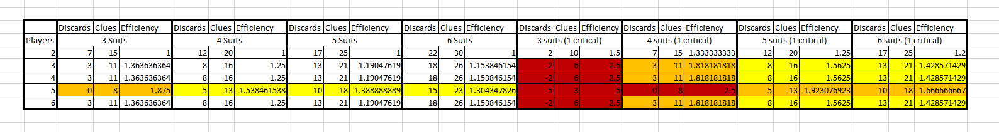

# Discard Principle

 

## Principle

Even with minimal communication errors, a game of Hanabi is easy to lose by running out of cards. There are 50 cards total, and half of them must be played to win, which means we are in fact allowed very few discards in order to complete the board before the deck runs out.

Playing and discarding both consume a card from the deck, bringing the end closer, therefore those moves can only be done a limited number of times.

Since you need to play 25 cards, your allowed discards are [total number of cards] - ([cards remaining in the hands at the end] + 25), and you are allowed a total of ([number of discards] + 8) clues to do so. All of these numbers depends on the number of players.

In a game with 5 people (5 suits, no variant), you are only allowed to discard a total of 10 cards during the entire game, and if you discard more, you lower your max score. This number is very low and may come as a surprise to players who haven't taken the time to do the math.

This is why it is of paramount importance to not discard too often during one game, and if you have a better move available, in most cases, you should do that instead.

This is also why Hanabi is easier, at least on paper, with 3 players than with 5.

 

## Table of discards

This table is the number of discards possible without reducing the max score, for different number of players and suits. Some combinations are simply unwinnable and shouldn't be played.

The table also shows the number of available clues (discards + 8), and therefore the minimum efficiency (cards played per clue, on average) needed to win the different combination

Red: Unwinnable unless the shuffle is extremely lucky, don't bother
Orange: Extremely hard and many shuffles will be unwinnable
Yellow: Hard and some shuffles will be unwinnable
No Color: Easy, All or almost all shuffles are winnable

    

A critical suit is a suit that only has one card of each (none of them can be discarded), totalling 5 cards of that suit instead of 10. Some suit variants, like black, are critical. Critical suits have a huge impact on the number of allowed discards, and are therefore very difficult to win.

 

## Navigation

* [Level 1 - First Principles](https://github.com/agilbert1412/HanabiStrategy/blob/master/Strategy/Level%201%20-%20First%20Principles/Level%201%20-%20First%20Principles.md)
	
* [Previous: Fix Clue](https://github.com/agilbert1412/HanabiStrategy/blob/master/Strategy/Level%201%20-%20First%20Principles/7%20-%20Fix%20Clue.md)
	* If you know a misplay is about to happen right now, spend a clue to fix it with information that contradicts what the person believed to be true. If you get a clue that contradict something you were sure to know, it is a Fix Clue.
	
* [Move on to Level 2 - Beginner Strategies](https://github.com/agilbert1412/HanabiStrategy/blob/master/Strategy/Level%202%20-%20Beginner/Level%202%20-%20Beginner.md)
	* Those are the first techniques that a new player will be introduced to. Mastery of those strategies will usually make the difference between victory and defeat on the base game