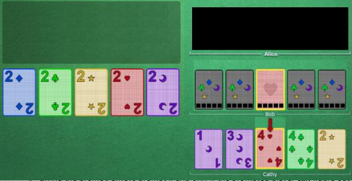
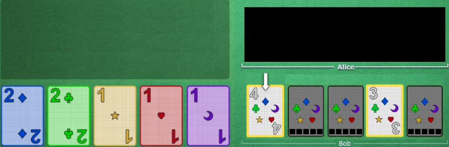
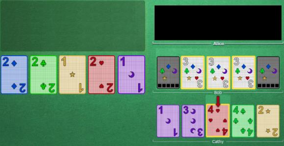

# The Prompt

 

## Technique

If a clue is given that is neither a save clue or a fix clue, you can usually assume that it is a play clue. Sometimes, a play clue will be given on a card that is not actually playable right now. If somebody else has a clued card that could be the missing link (and only one person could be the missing link), you can actually give the play clue.

The person receiving it should wait at least one turn to play if they see a playable "potential missing link" already clued in somebody's hand, to see if they will play it. To everyone else, it is even easier, because they see the card that has been play clued, so they know for sure if it is playable or not.

The only person who sees the clued card as non-playable AND who doesn't see the missing link, must have it. They should play their clued card that is the most likely to be it, which is their newest clued card that matches the desired card. If it's not the expected one, the promise that they can play is still valid, and they go on to the next matching card.

The player performing the prompt sees in which order the cards will be played to look for the missing link, and promises that everything that gets played prior to the expected card (if any) is also playable.

 

## Examples

    

Bob has a clued red card (good touch principle: this is either a 3, a 4 or a 5). Alice tells Cathy "Red", and touches the red 4 as a play clue. Bob Then knows that his card is the missing red 3, and can play it.

You can self-prompt a player with his own hand:

    

Clue the 4 to Bob. There is no 4 that is playable, therefore he knows that he must play a three to make it work. Bob then know that his 3 is playable and is the missing link. (Only if he doesn't see the missing link prompted in anyone else's hand, of course)

A Prompt cannot be a lie!

    

Here, Bob has the red 3, but if it is not on the most recent clued 3, the move is still valid if the other 2 are blue and/or green, so that he can play them, see that they were insufficient (but playable), and go to the next card until he finds the red 3. It must not be a lie, because Bob will keep playing until he finds it or misplays and realizes that something went wrong.

 

## Navigation

* [Level 2 - Beginner Strategies](https://github.com/agilbert1412/HanabiStrategy/blob/master/Strategy/Level%202%20-%20Beginner/Level%202%20-%20Beginner.md)

* [Previous: Early Game](https://github.com/agilbert1412/HanabiStrategy/blob/master/Strategy/Level%202%20-%20Beginner/9%20-%20Early%20Game.md)
	* When you discard an unknown card, always choose the oldest unclued card in your hand. Always pick up new cards on the same side to make this easy to track.

* [Next: The Finesse](https://github.com/agilbert1412/HanabiStrategy/blob/master/Strategy/Level%202%20-%20Beginner/11%20-%20The%20Finesse.md)
	* Same as Prompt, except none of the clued cards match the expected card. Then play your newest unclued card. Give out finesses to get new unclued cards played for free.