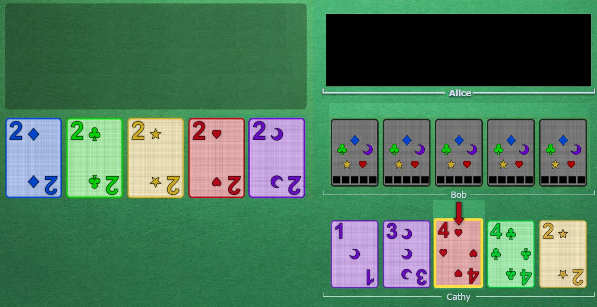
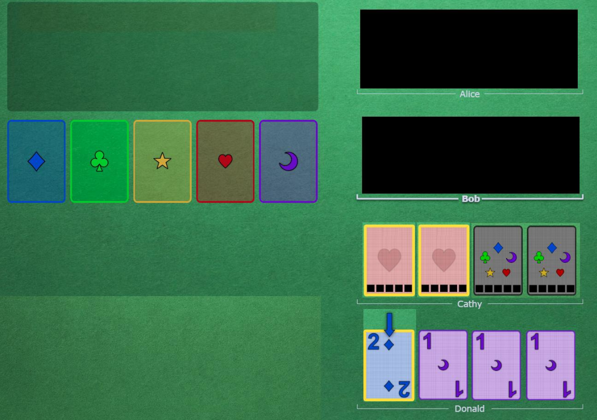

# The Finesse

 

## Technique

The finesse is a play that is very similar to [the Prompt](https://github.com/agilbert1412/HanabiStrategy/blob/master/Strategy/Level%202%20-%20Beginner/10%20-%20The%20Prompt.md). The main difference is that it is useful much more often, because you don't need the finessed card to be clued.

Following the logic of the Chop, which is that your oldest card is more likely to be useless (not taking clues into account of course), then your newest card is the most likely to be useful.

When you get prompted, this is the reason why you play the newest card that could fit the desired card. Cards that have a clue matching the desired card are the most likely to be it, and when all else is else is equal, the newest card is more likely to be it. The default interpretation is then that the newest is it, and if we want another interpretation, the clue must be more explicit.

Now, when none of the clued cards match the desired card, then the unclued cards are all equally likely to be it, so again, order breaks the tie. Your newest unclued card is therefore the most likely to be playable. If you are promised that you have a specific playable card, you should therefore play your newest. Again, if the newest is not the right one, it is the burden of the clue giver to make it more specific.

The finesse slot is defined as a player's most recent unclued card. If a play clue is given to a card that is unplayable right now, following from Trust your Teammates, you can assume that the missing card is in somebody's hand. The only person who doesn't see the missing card anywhere must have it.

In other words, when the clue is given, the person is promising that all the required cards to make that work are visible, and available with no extra clue (Clues don't rely on future clues to work). Any such card that you don't see, you can assume that you have. Clued cards that could be it take priority of course (Prompt), and then you go from newest to oldest unclued. You play your finesse slot.

Prompts take priority over finesses!

 

## Examples

In the following Example, after Alice points the Cathy's red 4 by saying "red", Bob knows he has the red 3, and it is on his finesse slot.

    

It is important to play finessed card as soon as possible, even if you have a good clue to give. The reason is that as long as you have not played it, there is an information desync. The finessed players know he should play, but the clued player also thinks that he should play because he doesn't see his own card. The finessed player should play on the very next turn to avoid the desync lasting more than one game turn, and make the clued player understand what is going on.

The finesse slot can move around like the chop, since it is the most recent unclued slot. For example, assuming the most recent card is on the left here:

    

This finesse actually points to Cathy's third card, since the first two are known as reds and are therefore not the desired blue1.

 

## Navigation

* [Level 2 - Beginner Strategies](https://github.com/agilbert1412/HanabiStrategy/blob/master/Strategy/Level%202%20-%20Beginner/Level%202%20-%20Beginner.md)

* [Previous: The Prompt](https://github.com/agilbert1412/HanabiStrategy/blob/master/Strategy/Level%202%20-%20Beginner/10%20-%20The%20Prompt.md)
	* Give a Play Clue to a higher-ranked card to notice someone that one of their clued cards goes in-between. Play the newest clued card that could be what is needed when someone prompts you.

* [Next: Starting 1s](https://github.com/agilbert1412/HanabiStrategy/blob/master/Strategy/Level%202%20-%20Beginner/12%20-%20Starting%201s.md)
	* If you have multiple playable 1s, play the ones that were not in your starting hand, from newest to oldest, then the ones that were in your starting hand, from oldest to newest