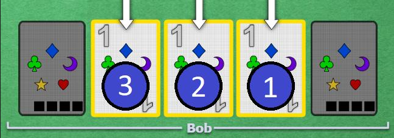
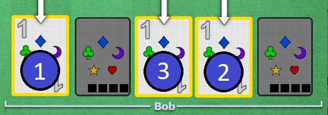

# Starting 1s

 

## Technique

Usually, when you get a play clue that touches multiple cards, it only means that the focus is playable. The rest is collateral, and may or may not be playable.
When it comes to 1s, however, if the clue is the number "1", any collateral is instantly known to be playable because of good touch principle. Any 1 that is not trash is immediately playable.

	* Definition of Freshly drawn -> A card that was not in your starting hand, but was picked up after playing or discarding something

Since 1s are a special case when it comes to play clues, the focus of the clue is pretty much irrelevant, since you expect them all to be playable anyway. In this case, which one should you play first?

On the first look, it might seem like playing any of them is equivalent, since even if you have an idea what 1s you have, you can't know which is which.

But when you think about it slightly deeper, you can find an optimal order.

First, if there is actually no duplication (good touch), it is true that they are all equivalent. But even if the team tries to not duplicate as much as possible, in some cases, it will happen anyway. Even if those cases are the minority, we've established that for non-duplication cases, no 1 is preferable, so only the duplication cases should guide our decision.

First, in the case where some 1s were in your starting hand, and some were not, you can imagine that since the clue was given after drawing cards, the freshly drawn 1s are obviously useful. So in the case of duplication, where SOME of your 1s are trash and you don't know, you should assume the more likely to be trash to be the ones that were in your starting hand.
You should logically play any freshly drawn 1s before the rest, to delay the need for a fix as much as possible (if a fix is needed). Following the same logic, the newest freshly drawn 1s should go first.

Now, when it comes to starting hand 1s, none of them is actually older. But some are closer to the chop. If you have duplication (ex: you have a red1 and two blue1s), and the duplicate is closer to the chop, then it is easy for the team to just wait for you to discard the duplicate before cluing it. Therefore, if they didn't wait, it seems probable that a potential duplication was further from the chop than the useful 1s. Again, to delay the need for the potential fix, you should play the "older" (not actually older, but closer to chop) 1s first when they were all in your starting hand.

So the correct order is: Any 1 that was not in your starting hand, from newest to oldest, followed by any 1 that was in your starting hand, from oldest to newest.

Now, this reasoning might be mathematically correct, but it is a very weak reason. For the vast majority of cases, this order wouldn't matter, and we are only establishing it for a small minority of cases. For this reason, it is possible to deviate from this "best" order if it gains some value in some other way, because pretty much any value gain would be more useful than the minuscule value of playing in the correct order.
This idea will be explored later when Chop Moves are adopted.

 

## Examples

Assuming the chop is on the right side on the screenshots, here is the order of play for the clued 1s

    

Then immediatly after playing the first one, Bob receives another 1-clue, so the order becomes this:

    

Of course, if at any point before he's done playing all of them, it becomes logically impossible that his remaining 1s are useful, he can start discarding the remaining ones.

 

## Navigation

* [Level 2 - Beginner Strategies](https://github.com/agilbert1412/HanabiStrategy/blob/master/Strategy/Level%202%20-%20Beginner/Level%202%20-%20Beginner.md)

* [Previous: The Finesse](https://github.com/agilbert1412/HanabiStrategy/blob/master/Strategy/Level%202%20-%20Beginner/11%20-%20The%20Finesse.md)
	* Same as Prompt, except none of the clued cards match the expected card. Then play your newest unclued card. Give out finesses to get new unclued cards played for free.

* [Next: ](https://github.com/agilbert1412/HanabiStrategy/blob/master/Strategy/Level%202%20-%20Beginner/10%20-%20The%20Prompt.md)